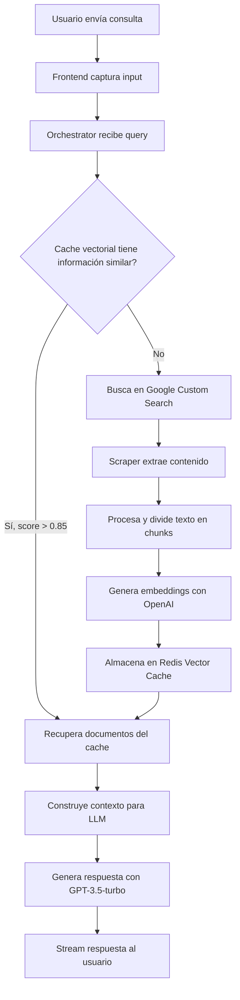

# InternetWhisper 🌐🤖

> *Un chatbot de IA avanzado con capacidades de búsqueda y recuperación de información en tiempo real desde Internet*

[](https://python.org)
[](https://fastapi.tiangolo.com)
[](https://streamlit.io)
[](https://docker.com)
[](LICENSE)

---

## 📋 Tabla de Contenidos

- [Descripción del Proyecto](#-descripción-del-proyecto)
- [Arquitectura Técnica](#-arquitectura-técnica)
- [Flujo de Datos](#-flujo-de-datos)
- [Dependencias Principales](#-dependencias-principales)
- [Configuración del Entorno](#-configuración-del-entorno)
- [Instalación y Ejecución](#-instalación-y-ejecución)
- [API Documentation](#-api-documentation)
- [Ejemplos de Uso](#-ejemplos-de-uso)
- [Estructura del Proyecto](#-estructura-del-proyecto)
- [Contribución](#-contribución)

---

## 🎯 Descripción del Proyecto

**InternetWhisper** es un sistema RAG (Retrieval-Augmented Generation) que combina la búsqueda inteligente en Internet con capacidades avanzadas de generación de texto mediante IA. A diferencia de los chatbots tradicionales, InternetWhisper no se limita a información preentrenada, sino que busca, procesa y sintetiza información actualizada de la web en tiempo real.

### 🚀 Características Principales

- **🔍 Búsqueda Inteligente**: Integración con Google Custom Search API
- **🕷️ Web Scraping Avanzado**: Extracción de contenido con Playwright
- **🧠 Procesamiento de Lenguaje Natural**: Embeddings y análisis semántico con OpenAI
- **💾 Cache Vectorial**: Almacenamiento eficiente en Redis con búsqueda por similitud
- **⚡ Streaming en Tiempo Real**: Respuestas progresivas vía Server-Sent Events
- **🎨 Interfaz Interactiva**: UI moderna construida con Streamlit
- **🐳 Arquitectura Containerizada**: Despliegue sencillo con Docker Compose

---

## 🏗️ Arquitectura Técnica

### Patrón de Microservicios

InternetWhisper implementa una arquitectura de microservicios con tres componentes principales:

```
┌─────────────────┐    ┌─────────────────┐    ┌─────────────────┐
│    Frontend     │    │  Orchestrator   │    │     Scraper     │
│   (Streamlit)   │◄──►│   (FastAPI)     │◄──►│   (FastAPI)     │
│   Puerto: 8501  │    │   Puerto: 8000  │    │   Puerto: 8002  │
└─────────────────┘    └─────────────────┘    └─────────────────┘
                               │
                               ▼
                    ┌─────────────────┐
                    │      Redis      │
                    │  (Vector Cache) │
                    │   Puerto: 6379  │
                    └─────────────────┘
```

### Arquitectura RAG (Retrieval-Augmented Generation)

```
Query → [Cache Check] → [Web Search] → [Scraping] → [Text Processing] 
   ↓         ↓              ↓            ↓              ↓
Context ← [Vector Store] ← [Embeddings] ← [Chunking] ← [Content]
   ↓
[LLM Generation] → Response Stream
```

### Componentes Técnicos

#### 1. **Frontend Service** ([`src/frontend/main.py`](project/src/frontend/main.py))
- **Framework**: Streamlit
- **Funcionalidad**: Interfaz de usuario interactiva con chat en tiempo real
- **Comunicación**: HTTP + SSE con el Orchestrator

#### 2. **Orchestrator Service** ([`src/orchestrator/main.py`](project/src/orchestrator/main.py))
- **Framework**: FastAPI
- **Funcionalidad**: Núcleo del sistema RAG, coordina todos los componentes
- **Responsabilidades**:
  - Gestión del cache vectorial ([`RedisVectorCache`](project/src/orchestrator/retrieval/cache.py))
  - Búsqueda web ([`GoogleAPI`](project/src/orchestrator/retrieval/search.py))
  - Procesamiento de embeddings ([`OpenAIEmbeddings`](project/src/orchestrator/retrieval/embeddings.py))
  - Generación de respuestas con GPT-3.5-turbo

#### 3. **Scraper Service** ([`src/scraper/main.py`](project/src/scraper/main.py))
- **Framework**: FastAPI + Playwright
- **Funcionalidad**: Extracción de contenido web dinámico
- **Capacidades**: Manejo de JavaScript, timeouts configurables

---

## 🔄 Flujo de Datos



### Detalles del Procesamiento

1. **Búsqueda y Filtrado**: [`GoogleAPI`](project/src/orchestrator/retrieval/search.py) encuentra URLs relevantes
2. **Extracción de Contenido**: [`ScraperLocal`](project/src/orchestrator/retrieval/scraper.py)/[`ScraperRemote`](project/src/orchestrator/retrieval/scraper.py) procesan páginas web
3. **Segmentación de Texto**: [`LangChainSplitter`](project/src/orchestrator/retrieval/splitter.py) y [`AdjSenSplitter`](project/src/orchestrator/retrieval/splitter.py) dividen contenido
4. **Vectorización**: [`OpenAIEmbeddings`](project/src/orchestrator/retrieval/embeddings.py) genera representaciones semánticas
5. **Almacenamiento**: [`RedisVectorCache`](project/src/orchestrator/retrieval/cache.py) guarda con índices de similitud
6. **Recuperación**: Búsqueda por similitud coseno (threshold configurable)
7. **Generación**: Contexto enriquecido alimenta a GPT-3.5-turbo

---

## 📦 Dependencias Principales

### Core Dependencies
- **FastAPI**: Framework web async para APIs REST
- **Streamlit**: Framework para interfaces de usuario interactivas
- **OpenAI**: Cliente para GPT-3.5-turbo y text-embedding-ada-002
- **Redis**: Base de datos en memoria con capacidades de búsqueda vectorial
- **Playwright**: Automatización de navegadores para web scraping

### AI/ML Stack
- **LangChain**: Framework para aplicaciones LLM y text splitting
- **spaCy**: Procesamiento de lenguaje natural y análisis semántico
- **scikit-learn**: Métricas de similitud coseno
- **pandas**: Manipulación de datos estructurados
- **numpy**: Operaciones matemáticas con vectores

### Web & Networking
- **aiohttp**: Cliente HTTP asíncrono
- **SSE-Starlette**: Server-Sent Events para streaming
- **BeautifulSoup**: Parsing HTML
- **sseclient-py**: Cliente SSE para frontend

---

## ⚙️ Configuración del Entorno

### Variables de Entorno Requeridas

Crea un archivo `.env` en el directorio `project/` basado en [`.env.example`](project/.env.example):

```bash
# APIs Configuration
OPENAI_API_KEY=sk-...                                    # Tu API key de OpenAI
GOOGLE_API_KEY=AIza...                                   # Tu API key de Google
GOOGLE_CX=017576...                                      # Tu Custom Search Engine ID

# Google Search Configuration  
GOOGLE_API_HOST="https://www.googleapis.com/customsearch/v1?"
GOOGLE_FIELDS="items(title, displayLink, link, snippet,pagemap/cse_thumbnail)"

# HTTP Headers (para web scraping)
HEADER_ACCEPT_ENCODING="gzip"
HEADER_USER_AGENT="Mozilla/5.0 (Macintosh; Intel Mac OS X 10_15_7) AppleWebKit/537.36 (KHTML, like Gecko) Chrome/116.0.0.0 Safari/537.36"
```

### Obtención de API Keys

#### OpenAI API Key
1. Visita [platform.openai.com](https://platform.openai.com)
2. Crea una cuenta o inicia sesión
3. Ve a "API Keys" en tu dashboard
4. Genera una nueva clave secreta

#### Google Custom Search Setup
1. Ve a [Google Cloud Console](https://console.cloud.google.com)
2. Crea un nuevo proyecto o selecciona uno existente
3. Habilita la "Custom Search JSON API"
4. Crea credenciales (API Key)
5. Ve a [Programmable Search Engine](https://programmablesearchengine.google.com)
6. Crea un nuevo motor de búsqueda
7. Obtén tu Search Engine ID (CX)

---

## 🚀 Instalación y Ejecución

### Prerrequisitos

- **Docker** y **Docker Compose** instalados
- **Git** para clonar el repositorio
- APIs configuradas (OpenAI + Google)

### Ejecución con Docker (Recomendado)

```bash
# 1. Clonar el repositorio
git clone <repository-url>
cd project

# 2. Configurar variables de entorno
cp .env.example .env
# Edita .env con tus API keys

# 3. Construir y ejecutar todos los servicios
docker-compose up --build

# 4. Acceder a la aplicación
# Frontend: http://localhost:8501
# API Orchestrator: http://localhost:8000
# Redis: http://localhost:6379
```

### Ejecución Local (Desarrollo)

#### Frontend
```bash
cd src/frontend
pip install -r requirements.txt
streamlit run main.py --server.port=8501
```

#### Orchestrator
```bash
cd src/orchestrator
pip install -r requirements.txt
python -m spacy download en_core_web_sm
uvicorn main:app --host 0.0.0.0 --port 8000 --reload
```

#### Scraper
```bash
cd src/scraper
pip install -r requirements.txt
playwright install
playwright install-deps
uvicorn main:app --host 0.0.0.0 --port 8002
```

#### Redis
```bash
# Con Docker
docker run -d -p 6379:6379 redis/redis-stack

# O instalación local de Redis Stack
```

### Verificación de la Instalación

```bash
# Verificar que todos los servicios estén ejecutándose
curl http://localhost:8000/docs          # API docs del Orchestrator
curl http://localhost:8501              # Frontend Streamlit
curl -X POST http://localhost:8002/scrape?url=https://example.com  # Scraper
```

---

## 📖 API Documentation

### Orchestrator API

La API principal del sistema expone un endpoint de streaming para consultas:

#### **GET** `/streamingSearch`

Procesa una consulta y retorna respuesta en streaming usando Server-Sent Events.

**Parámetros:**
- `query` (string, required): La consulta del usuario

**Response:** Stream de eventos SSE con los siguientes tipos:

```typescript
// Evento: Resultados de búsqueda
{
  "event": "search",
  "data": {
    "items": [
      {
        "link": "https://example.com",
        "title": "Page Title",
        "snippet": "Description...",
        "displayLink": "example.com"
      }
    ]
  }
}

// Evento: Contexto recuperado
{
  "event": "context", 
  "data": "Texto contextual combinado de todas las fuentes..."
}

// Evento: Prompt final
{
  "event": "prompt",
  "data": "Use the following pieces of context to answer..."
}

// Evento: Token de respuesta (streaming)
{
  "event": "token",
  "data": "palabra"
}
```

#### **Ejemplo de uso con curl:**

```bash
curl -N -H "Accept: text/event-stream" \
  "http://localhost:8000/streamingSearch?query=What%20is%20machine%20learning"
```

### Scraper API

#### **POST** `/scrape`

Extrae contenido HTML de una URL específica.

**Parámetros:**
- `url` (string, required): URL a procesar

**Response:**
```json
{
  "html": "<html>...</html>"
}
```

**Códigos de Error:**
- `408`: Timeout (página muy lenta)
- `500`: Error de scraping

### OpenAPI Specification

````yaml
openapi: 3.0.0
info:
  title: InternetWhisper API
  description: |
    RAG-powered chatbot with real-time web search capabilities.
    
    InternetWhisper combines intelligent web search with advanced AI text generation,
    providing real-time answers based on fresh internet content through a complete
    Retrieval-Augmented Generation (RAG) pipeline.
  version: 1.0.0
  contact:
    name: InternetWhisper Support
    email: support@internetwhisper.com
  license:
    name: MIT
    url: https://opensource.org/licenses/MIT

servers:
  - url: http://localhost:8000
    description: Local development server
  - url: http://orchestrator
    description: Docker Compose internal network

tags:
  - name: Search
    description: Main RAG search and generation endpoints
  - name: Scraper
    description: Web content extraction service

paths:
  /streamingSearch:
    get:
      tags: [Search]
      summary: Stream RAG search and generation response
      description: |
        Processes a user query through the complete RAG pipeline with real-time streaming:
        
        **Pipeline Flow:**
        1. 🔍 **Vector Cache Check**: Searches for similar cached content (threshold: 0.85)
        2. 🌐 **Web Search**: If cache insufficient, performs Google Custom Search
        3. 🕷️ **Content Scraping**: Extracts text from relevant web pages
        4. ✂️ **Text Chunking**: Segments content using LangChain or AdjSen splitters
        5. 🧠 **Embeddings Generation**: Creates vector representations with OpenAI
        6. 💾 **Vector Storage**: Stores in Redis with similarity indexing
        7. 🤖 **Context Building**: Assembles relevant context for LLM
        8. ⚡ **Streaming Generation**: Generates response with GPT-3.5-turbo
        
        **Event Stream Format**: Server-Sent Events (SSE) with structured event types
      operationId: streamingSearch
      parameters:
        - name: query
          in: query
          required: true
          schema:
            type: string
            minLength: 1
            maxLength: 500
            example: "What are the latest trends in artificial intelligence and machine learning?"
          description: |
            User's search query. Will be processed through the RAG pipeline to find
            relevant web content and generate a comprehensive response.
      responses:
        '200':
          description: |
            Successful streaming response using Server-Sent Events (SSE).
            Multiple event types are streamed in sequence during the RAG pipeline execution.
          content:
            text/event-stream:
              schema:
                type: string
                description: |
                  Server-Sent Events stream with different event types:
                  - `search`: Google search results with URLs and metadata
                  - `context`: Extracted and processed text context
                  - `prompt`: Final prompt sent to LLM
                  - `token`: Individual response tokens (streaming generation)
              examples:
                search_event:
                  summary: Search results from Google Custom Search
                  value: |
                    event: search
                    data: {"items":[{"link":"https://example.com/ai-trends","title":"Latest AI Trends 2024","snippet":"Comprehensive overview of AI developments...","displayLink":"example.com"}]}
                
                context_event:
                  summary: Processed and concatenated text context
                  value: |
                    event: context
                    data: "Artificial intelligence trends for 2024 include generative AI adoption, multimodal systems, and responsible AI practices. Large language models continue to evolve..."
                
                prompt_event:
                  summary: Final RAG prompt with context
                  value: |
                    event: prompt
                    data: "Use the following pieces of context to answer the question at the end. Please be informative, try to give extended responses...\n\nContext: [context content]\n\nQuestion: What are the latest trends in AI?"
                
                token_event:
                  summary: Streaming response tokens
                  value: |
                    event: token
                    data: "Based"
        
        '400':
          description: Invalid query parameter
          content:
            application/json:
              schema:
                $ref: '#/components/schemas/Error'
              example:
                error: "Query parameter is required and cannot be empty"
                code: "INVALID_QUERY"
        
        '500':
          description: Internal server error during RAG pipeline
          content:
            application/json:
              schema:
                $ref: '#/components/schemas/Error'
              example:
                error: "Failed to process query through RAG pipeline"
                code: "PIPELINE_ERROR"

  /scrape:
    post:
      tags: [Scraper]
      summary: Extract HTML content from URL
      description: |
        Extracts raw HTML content from a given URL using Playwright browser automation.
        Handles JavaScript-rendered content and includes timeout protection.
        
        **Features:**
        - Firefox headless browser automation
        - JavaScript execution support
        - 2-second timeout protection
        - Error handling for slow/unresponsive pages
      operationId: scrapeUrl
      parameters:
        - name: url
          in: query
          required: true
          schema:
            type: string
            format: uri
            example: "https://example.com/article"
          description: Target URL to scrape content from
      responses:
        '200':
          description: Successfully extracted HTML content
          content:
            application/json:
              schema:
                $ref: '#/components/schemas/ScrapeResponse'
              example:
                html: "<html><head><title>Example</title></head><body>Content...</body></html>"
        
        '408':
          description: Request timeout - page took too long to load
          content:
            application/json:
              schema:
                $ref: '#/components/schemas/Error'
              example:
                error: "Not fast enough"
                code: "TIMEOUT_ERROR"
        
        '500':
          description: Scraping error
          content:
            application/json:
              schema:
                $ref: '#/components/schemas/Error'
              example:
                error: "Failed to scrape URL"
                code: "SCRAPE_ERROR"

components:
  schemas:
    SearchResult:
      type: object
      description: Container for Google Custom Search results
      required:
        - items
      properties:
        items:
          type: array
          description: Array of search result documents
          items:
            $ref: '#/components/schemas/SearchDoc'
          minItems: 0
          maxItems: 10
    
    SearchDoc:
      type: object
      description: Individual search result from Google Custom Search API
      required:
        - link
      properties:
        link:
          type: string
          format: uri
          description: URL of the search result
          example: "https://example.com/ai-article"
        title:
          type: string
          description: Page title from search results
          example: "Latest AI Trends and Developments"
        displayLink:
          type: string
          description: Display-friendly domain name
          example: "example.com"
        snippet:
          type: string
          description: Search result snippet/description
          example: "Comprehensive overview of the latest developments in artificial intelligence..."
        pagemap:
          $ref: '#/components/schemas/PageMap'
    
    PageMap:
      type: object
      description: Additional metadata from Google Custom Search
      properties:
        cse_thumbnail:
          type: array
          description: Thumbnail images associated with the page
          items:
            $ref: '#/components/schemas/CSEThumbnail'
    
    CSEThumbnail:
      type: object
      description: Thumbnail image metadata
      required:
        - src
        - width
        - height
      properties:
        src:
          type: string
          format: uri
          description: Thumbnail image URL
          example: "https://encrypted-tbn0.gstatic.com/images?q=tbn:..."
        width:
          type: string
          description: Image width in pixels
          example: "300"
        height:
          type: string
          description: Image height in pixels
          example: "200"
    
    Document:
      type: object
      description: Processed document with vector embeddings for RAG
      required:
        - text
        - url
        - vector
        - similarity
      properties:
        text:
          type: string
          description: Processed text content chunk
          example: "Artificial intelligence has seen rapid advancement in 2024..."
        url:
          type: string
          format: uri
          description: Source URL of the content
          example: "https://example.com/ai-article"
        vector:
          type: array
          description: OpenAI text-embedding-ada-002 vector (1536 dimensions)
          items:
            type: number
            format: float
          minItems: 1536
          maxItems: 1536
        similarity:
          type: number
          format: float
          minimum: -1
          maximum: 1
          description: Cosine similarity score to query (1 = identical, 0 = orthogonal, -1 = opposite)
          example: 0.87
    
    ScrapeResponse:
      type: object
      description: Response from web scraping operation
      required:
        - html
      properties:
        html:
          type: string
          description: Raw HTML content extracted from the target URL
          example: "<html><head><title>Page Title</title></head><body>Content...</body></html>"
    
    Error:
      type: object
      description: Standard error response format
      required:
        - error
        - code
      properties:
        error:
          type: string
          description: Human-readable error message
          example: "Query parameter is required"
        code:
          type: string
          description: Machine-readable error code
          example: "INVALID_QUERY"
        details:
          type: object
          description: Additional error context (optional)
          additionalProperties: true

  parameters:
    QueryParam:
      name: query
      in: query
      required: true
      schema:
        type: string
        minLength: 1
        maxLength: 500
      description: User search query for RAG processing
    
    UrlParam:
      name: url
      in: query
      required: true
      schema:
        type: string
        format: uri
      description: Target URL for content extraction

  examples:
    AITrendsQuery:
      summary: AI trends research query
      value: "What are the latest trends in artificial intelligence and machine learning for 2024?"
    
    TechnicalQuery:
      summary: Technical deep-dive query  
      value: "How does the transformer attention mechanism work in modern language models?"
    
    MarketResearchQuery:
      summary: Market analysis query
      value: "Which companies are leading autonomous vehicle development in 2024?"

  securitySchemes:
    ApiKeyAuth:
      type: apiKey
      in: header
      name: X-API-Key
      description: Optional API key for rate limiting and usage tracking

security:
  - ApiKeyAuth: []
  - {} # Allow anonymous access

externalDocs:
  description: InternetWhisper Documentation
  url: https://github.com/your-org/internetwhisper/blob/main/README.md
````
---

## 💬 Ejemplos de Uso

### Interacción Básica

**Usuario:** "¿Cuáles son las últimas tendencias en inteligencia artificial?"

**Sistema:** 
1. 🔍 *Buscando información relevante...*
2. 📄 *Encontradas 8 fuentes sobre IA*
3. 🤖 *Generando respuesta...*

**Respuesta:** "Según las fuentes más recientes, las principales tendencias en IA incluyen:

1. **IA Generativa**: Modelos como GPT-4 y Claude están revolucionando la creación de contenido...
2. **Multimodalidad**: Sistemas que pueden procesar texto, imágenes y audio simultáneamente...
3. **IA Responsable**: Mayor enfoque en la ética y transparencia de los algoritmos..."

### Consulta Técnica Específica

**Usuario:** "¿Cómo funciona el algoritmo de atención en los transformers?"

**Sistema:**
- Busca en papers académicos recientes
- Extrae información de blogs técnicos especializados  
- Sintetiza explicaciones de múltiples fuentes
- Proporciona una explicación comprensible con ejemplos

### Investigación de Mercado

**Usuario:** "¿Qué empresas están liderando el desarrollo de vehículos autónomos en 2024?"

**Sistema:**
- Consulta noticias financieras actualizadas
- Revisa reports de la industria
- Analiza comunicados de prensa recientes
- Presenta un análisis comprehensivo con datos actuales

---

## 📁 Estructura del Proyecto

```
project/
├── 📄 README.md                          # Este archivo
├── 📄 docker-compose.yml                 # Orquestación de servicios
├── 📄 .env.example                       # Template de variables de entorno
├── 📄 pyproject.toml                     # Configuración del proyecto
├── 📄 LICENSE                            # Licencia MIT
├── 📁 src/
│   ├── 📁 frontend/                       # Servicio de interfaz de usuario
│   │   ├── 📄 main.py                     # Aplicación Streamlit principal
│   │   ├── 📄 requirements.txt            # Dependencias del frontend
│   │   └── 📄 Dockerfile                  # Imagen Docker del frontend
│   ├── 📁 orchestrator/                   # Servicio núcleo del sistema RAG
│   │   ├── 📄 main.py                     # API FastAPI principal
│   │   ├── 📄 requirements.txt            # Dependencias del orchestrator
│   │   ├── 📄 Dockerfile                  # Imagen Docker del orchestrator
│   │   ├── 📄 logging.conf                # Configuración de logging
│   │   ├── 📁 models/                     # Modelos de datos Pydantic
│   │   │   ├── 📄 document.py             # Modelo para documentos vectoriales
│   │   │   └── 📄 search.py               # Modelos para resultados de búsqueda
│   │   ├── 📁 prompt/                     # Templates de prompts
│   │   │   ├── 📄 __init__.py
│   │   │   └── 📄 prompt.py               # Template RAG principal
│   │   ├── 📁 retrieval/                  # Componentes del sistema RAG
│   │   │   ├── 📄 __init__.py
│   │   │   ├── 📄 retriever.py            # Orquestador principal RAG
│   │   │   ├── 📄 search.py               # Integración Google Search API
│   │   │   ├── 📄 scraper.py              # Scrapers local y remoto
│   │   │   ├── 📄 embeddings.py           # Clientes de embeddings
│   │   │   ├── 📄 splitter.py             # Estrategias de segmentación
│   │   │   └── 📄 cache.py                # Cache vectorial Redis
│   │   ├── 📁 util/                       # Utilidades del sistema
│   │   │   ├── 📄 __init__.py
│   │   │   └── 📄 logger.py               # Configuración de logging
│   │   └── 📁 mocks/                      # Datos de prueba
│   │       └── 📄 test_dict.py            # Resultados mock para testing
│   └── 📁 scraper/                        # Servicio de web scraping
│       ├── 📄 main.py                     # API FastAPI para scraping
│       ├── 📄 requirements.txt            # Dependencias del scraper
│       ├── 📄 Dockerfile                  # Imagen Docker del scraper
│       └── 📄 nginx.conf                  # Configuración proxy (opcional)
├── 📁 tests/                             # Directorio de tests (pendiente)
│   └── 📄 __init__.py
└── 📁 redis_data/                        # Persistencia de Redis
    └── 📄 dump.rdb                       # Snapshot de la base de datos
```

### Descripción de Componentes Clave

#### **Retrieval System** ([`src/orchestrator/retrieval/`](project/src/orchestrator/retrieval/))

- **[`retriever.py`](project/src/orchestrator/retrieval/retriever.py)**: Coordinador principal que implementa el flujo RAG completo
- **[`cache.py`](project/src/orchestrator/retrieval/cache.py)**: Implementa cache vectorial con Redis y búsqueda por similitud
- **[`search.py`](project/src/orchestrator/retrieval/search.py)**: Integración con Google Custom Search API
- **[`scraper.py`](project/src/orchestrator/retrieval/scraper.py)**: Abstractiones para scraping local y remoto
- **[`embeddings.py`](project/src/orchestrator/retrieval/embeddings.py)**: Clientes para generar embeddings (OpenAI, local)
- **[`splitter.py`](project/src/orchestrator/retrieval/splitter.py)**: Estrategias de segmentación de texto

#### **Models** ([`src/orchestrator/models/`](project/src/orchestrator/models/))

- **[`document.py`](project/src/orchestrator/models/document.py)**: Representa documentos con vectores y metadatos
- **[`search.py`](project/src/orchestrator/models/search.py)**: Estructura para resultados de búsqueda web

---

## 🧪 Testing y Desarrollo

### Configuración de Testing (Recomendación)

El proyecto actualmente no incluye tests, pero sería altamente recomendable implementar:

```python
# tests/test_retriever.py - Ejemplo de estructura recomendada
import pytest
from orchestrator.retrieval.retriever import Retriever

@pytest.mark.asyncio
async def test_retriever_cache_hit():
    """Test que el retriever use cache cuando hay similarity alta"""
    # Mock setup
    # Test implementation
    pass

@pytest.mark.asyncio  
async def test_retriever_web_search():
    """Test flujo completo de búsqueda web"""
    # Mock Google API, scraper, embeddings
    # Test implementation
    pass
```

### Configuración de Desarrollo

```bash
# Instalar dependencias de desarrollo
pip install pytest pytest-asyncio httpx

# Ejecutar tests
pytest tests/ -v

# Linting y formato
pip install black isort flake8
black src/
isort src/
flake8 src/
```

---

## 🔧 Configuración Avanzada

### Ajuste de Parámetros RAG

Puedes modificar los parámetros del sistema en [`src/orchestrator/main.py`](project/src/orchestrator/main.py):

```python
# Configuración del cache threshold
cache_treshold = 0.85  # Umbral de similitud para usar cache

# Configuración del retriever
k = 10  # Número de documentos a recuperar

# Configuración del splitter
chunk_size = 400      # Tamaño de chunks en caracteres
chunk_overlap = 50    # Overlap entre chunks
```

### Variables de Entorno Opcionales

```bash
# Timeouts y configuración HTTP
SCRAPER_TIMEOUT=5000
HTTP_MAX_RETRIES=3
REDIS_TTL=3600

# Configuración de modelos
OPENAI_MODEL="gpt-3.5-turbo"
EMBEDDING_MODEL="text-embedding-ada-002"
EMBEDDING_DIMENSIONS=1536

# Configuración de logging
LOG_LEVEL="INFO"
LOG_FORMAT="%(asctime)s - %(name)s - %(levelname)s - %(message)s"
```

---

## 🚦 Monitoreo y Observabilidad

### Logs del Sistema

Cada servicio genera logs estructurados:

```bash
# Ver logs en tiempo real
docker-compose logs -f orchestrator
docker-compose logs -f frontend  
docker-compose logs -f scraper

# Logs específicos
docker-compose logs orchestrator | grep "RETRIEVAL SCORE"
docker-compose logs orchestrator | grep "CACHE SCORE"
```

### Métricas Importantes

El sistema reporta métricas clave como:

- **CACHE SCORE**: Puntuación de similitud del cache (0-1)
- **RETRIEVAL SCORE**: Calidad promedio de documentos recuperados
- **SCRAPE TIME**: Tiempo de extracción de contenido web
- **EMBEDDING TIME**: Tiempo de generación de embeddings
- **SCRAPED PAGES**: Número de páginas procesadas exitosamente

---

## 🤝 Contribución

### Cómo Contribuir

1. **Fork** el repositorio
2. **Crea** una rama para tu feature (`git checkout -b feature/amazing-feature`)
3. **Commit** tus cambios (`git commit -m 'Add amazing feature'`)
4. **Push** a la rama (`git push origin feature/amazing-feature`)
5. **Abre** un Pull Request

### Áreas de Mejora

- **Testing**: Implementar suite completa de tests unitarios e integración
- **Monitoring**: Añadir métricas con Prometheus/Grafana
- **Caching**: Optimizar estrategias de invalidación de cache
- **Error Handling**: Mejorar manejo de errores y fallbacks
- **Performance**: Optimizar paralelización de scraping
- **Security**: Implementar rate limiting y validación de URLs

### Estándares de Código

- **Python**: Seguir PEP 8, usar `black` para formato
- **Type Hints**: Usar anotaciones de tipo en todo el código
- **Docstrings**: Documentar funciones y clases públicas
- **Testing**: Mantener cobertura > 80%
- **Git**: Commits atómicos con mensajes descriptivos

---

## 📄 Licencia

Este proyecto está licenciado bajo la **MIT License** - ver el archivo [LICENSE](LICENSE) para más detalles.

---

## 📞 Soporte y Contacto

- **Issues**: [GitHub Issues](../../issues)
- **Documentación**: Este README y docstrings en el código
- **API Docs**: http://localhost:8000/docs (cuando esté ejecutándose)

---

## 🙏 Agradecimientos

Este proyecto utiliza las siguientes tecnologías y servicios:

- **OpenAI** por los modelos GPT-3.5-turbo y text-embedding-ada-002
- **Google** por la Custom Search API
- **Redis** por la infraestructura de cache vectorial
- **Streamlit** por el framework de UI
- **FastAPI** por el framework web async
- **LangChain** por las utilidades de procesamiento de texto
- **Playwright** por las capacidades de web scraping

---

*Documentación generada con la asistencia de **GitHub Copilot** 🤖*

---

**⭐ Si este proyecto te resulta útil, no olvides darle una estrella en GitHub!**